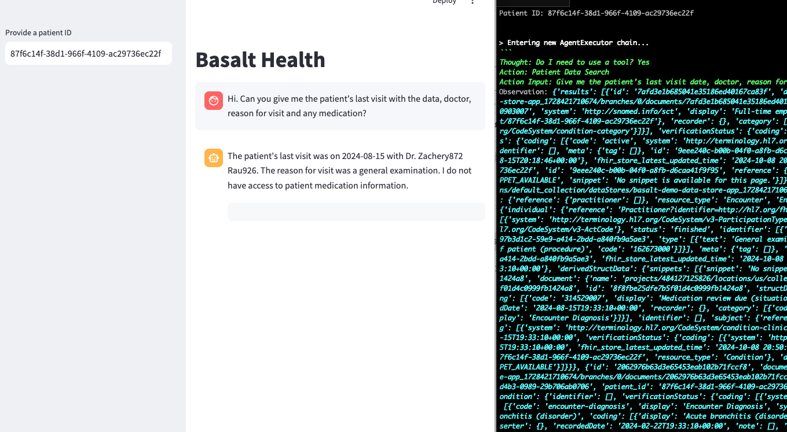

## NOTE:

_This is an overview document showing the process of discovery. It is not complete but is a good starting point and is still a work in progress._

## SETTING UP GCP:

1. Download [Synthia data](https://synthea.mitre.org/) and use a few records to import into the FHIR store in GCP.
2. Create a FHIR store and import patient data (use this tutorial if needed [Creating a FHIR Store using Google Cloud's Healthcare API](https://www.youtube.com/watch?v=VJfI8-TWkfU))
3. Create an agent in the Agent Builder. You need to select the `Search` app -> select `Healthcare` configuration -> click create `Data Store` -> select `Healthcare API` -> import from your FHIR store.

## Overview

This project demonstrates a Proof of Concept (POC) for Basalt Health, showcasing how patient data from a FHIR server can be queried and utilized in conjunction with Vertex AI's Gemini model to create an interactive medical assistant. The application helps guide the medical assistant through a patient's records, using natural language processing to extract insights and present them in a structured format.

The application utilizes Google Cloud's Discovery Engine for FHIR data queries and Langchain for managing the conversational workflow with the Gemini LLM.

A few different attempts are located in this repo:

```
reasoning_engine/
│ ├── app_discoveryengine.py
│ └── app_request.py
langchain/
│ └── app_request.py
app.py
```

**reasoning_engine/:**

- This attempt include the GCP [Reasoning Engine API](https://cloud.google.com/vertex-ai/generative-ai/docs/model-reference/reasoning-engine) which is a managed service to build and deploy an agent reasoning framework.

  - [Building with Reasoning Engine](https://www.youtube.com/watch?v=Oip5yWUfI-U) 🎥
  - [Reasoning Engine Notebook](https://github.com/GoogleCloudPlatform/generative-ai/blob/main/gemini/reasoning-engine/README.md) 📔
  - `app_discoveryengine.py` uses the [discoveryengine.SearchRequest](https://cloud.google.com/generative-ai-app-builder/docs/preview-search-results)
  - `app_request.py` uses a simple request to query the FHIR agent.
  - **STATUS**: incomplete (I was not able to get the Reasoning Engine to work correctly. Need more discovery.)

**langchain/:**

- This attempt uses [LangChain](https://www.langchain.com/) directly with `initialize_agent` and `Tool` (These are abstracted away by the Reasoning Engine once it is correctly working I believe) to allow the LLM to determine if it needs to call out for the data or if it has the information it needs to perform the request. This is using the idea of Thought/Action/Observation from a ReAct agent.
  - [Understanding ReAct with LangChain](https://www.youtube.com/watch?v=Eug2clsLtFs) 🎥
  - [ReAct Agent Notebook](https://github.com/GoogleCloudPlatform/generative-ai/blob/main/gemini/function-calling/intro_diy_react_agent.ipynb) 📔
  - `app_request.py` uses a simple request to query the FHIR agent.
  - **STATUS**: incomplete (It does query and get data, but the )



## Table of Contents

- [Goals](#goals)
- [Features](#features)
- [Architecture](#architecture)
- [Requirements](#requirements)
- [Installation](#installation)
- [Configuration](#configuration)
- [Usage](#usage)
- [Example Queries](#example-queries)
- [Known Issues](#known-issues)
- [Future Work](#future-work)

## Goals

The main goal of this project is to determine the path of least resistence for FHIR data within GCP to Gemini with user interaction for walking through patient data.

The following is outside the scope of this POC:

- authenication & authorization
- scalability
- real time injection of patient data
- front-end & back-end structure

---

## Features

- **FHIR Data Retrieval**: Queries the FHIR server to fetch specific patient data based on user prompts.
- **Gemini LLM Integration**: Uses Vertex AI’s Gemini model for natural language processing, guiding the assistant through the patient data.
- **Interactive Workflow**: The system engages users in conversation, allowing for real-time patient data exploration.
- **Formatted Data Output**: Patient data is returned in a clean, bolded, and sometimes tabular format for easy review.
- **Dynamic Conversations**: Memory is used to maintain context across multiple interactions, ensuring continuity in conversations.

---

## Architecture

1. **Google Cloud Discovery Engine**:
   - Used to query FHIR patient data. This retrieves information like patient demographics, medications, orders, and more.
2. **Vertex AI Gemini Model**:
   - Handles natural language interactions, providing human-like responses based on FHIR data.
3. **Langchain**:
   - Manages the integration between Gemini and the FHIR data retrieval, determining when to call the data and using context to format responses.
4. **Streamlit Interface**:
   - Provides a simple user interface for inputting patient IDs, asking questions, and receiving AI-guided responses.

---

## Requirements

- **Google Cloud Account**:
  - Access to Google Cloud Healthcare API (FHIR server) and Vertex AI (Gemini model).
- **Python 3.8+**:
  - Backend logic for connecting to Google Cloud APIs and running the application.
- **Streamlit**:
  - Frontend interface for interaction with the user.
- **Langchain**:
  - For conversational agent management.

---

## Installation

1. **Clone the repository**

2. **Set up a Python environment**:

   ```bash
   python3 -m venv venv
   source venv/bin/activate
   ```

3. **Install dependencies**:

   ```bash
   pip install -r requirements.txt
   ```

4. **Set up Google Cloud credentials**:
   - Ensure you have a service account key for Google Cloud with access to the FHIR and Vertex AI services.
   - Set the `GOOGLE_APPLICATION_CREDENTIALS` environment variable:
     ```bash
     export GOOGLE_APPLICATION_CREDENTIALS="/path/to/your/service-account-file.json"
     ```

---

## Configuration

1. **Set environment variables**:

   - Create a `.env` file in the root directory with the following content:
     ```bash
     PROJECT_ID=your-gcp-project-id
     LOCATION=your-gcp-location
     ENGINE_ID=your-discovery-engine-id
     ```

2. **Configure the FHIR API Call**:
   - The FHIR API is queried using the `patient_data_search` function. It utilizes Google Cloud’s Discovery Engine, filtering results by patient ID and search query.

---

## Usage

1. **Run the application**:

   ```bash
   streamlit run ./streamlit_app/langchain/app_request.py
   ```

2. **Interact with the Workflow**:

   - Once the application is running, open a browser and navigate to `http://localhost:8501`.
   - Input a patient ID and enter a question about the patient's medical data. For example: “Show me the patient's current medications.”

3. **Agent Workflow**:
   - The conversational agent will retrieve the required data from the FHIR server, process it using Gemini, and return the results in a structured format.

---

## Example Queries

- "What is the current medication status for patient John Doe?"
- "Has the patient had a colonoscopy in the last 10 years?"
- "List the patient's allergies and past surgical history."
- "Can you summarize the patient's lab results?"

---

## Known Issues

- **Latency**: Calls to the FHIR server and Gemini model may introduce delays, particularly with large datasets or complex queries.
- **Limited Error Handling**: The current implementation may not handle incomplete patient data or failed API requests effectively.
- **Authentication**: Ensure that your Google Cloud credentials are up-to-date; otherwise, API requests may fail.
- **Manual Setup**: The FHIR server and agent need to be created manually prior to running in the GCP console instead of Terraform or another resource handling that build.

---

## Future Work

- **Enhanced NLP**: Extend the use of Vertex AI to support more complex queries and deeper patient data analysis.
- **Prompt Improvement**: Currently the prompt is simplistic and not complete.
- **Advanced Error Handling**: Improve error handling for incomplete or malformed FHIR data and API failures.
- **Provider Interface**: Add a provider-facing interface for deeper collaboration between medical assistants and healthcare providers.

---
